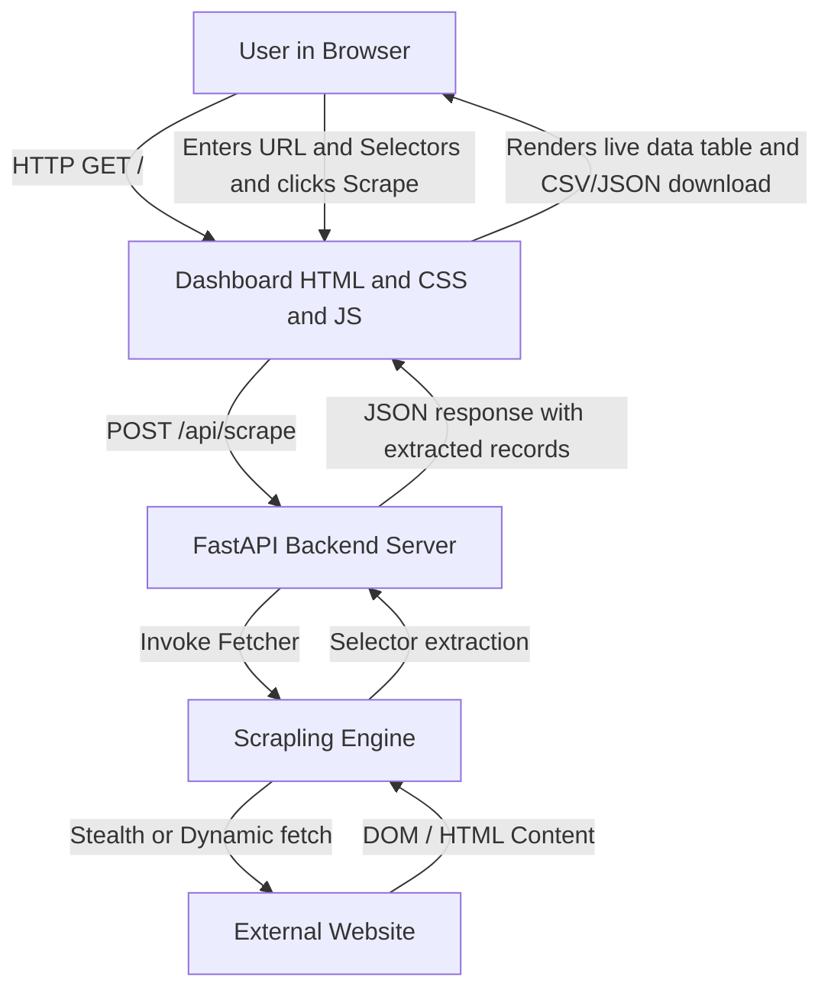

# Scrapling Web Dashboard Architecture Plan

## Overview
Scrapling out-of-the-box is a headless Python library without frontend assets. To give you a graphical web dashboard that you can visit in your browser on your server, we will build a full-featured, lightweight web application powered by FastAPI and a modern HTML/CSS/JavaScript interface.

## System Architecture



## Features of the Web Dashboard

1. **URL & Mode Configuration**:
   - URL input bar.
   - Fetcher engine selector: `Basic Fetcher` (fastest), `Stealthy Fetcher` (bypasses Cloudflare & bot protection), or `Dynamic Fetcher` (executes JavaScript).
   - Network idle wait toggle.

2. **Visual Selector Builder**:
   - Dynamic rows to add custom fields (e.g., `Title` -> `h1`, `Price` -> `.price`, `Image` -> `img::attr(src)`).
   - Preset modes: Quick Extract (page title, headings, meta tags, all links, or page content converted to Markdown).

3. **Live Result Viewer & Exporters**:
   - Interactive data table showing extracted items.
   - One-click export to `JSON` or `CSV`.
   - Raw HTML / Markdown viewer tab.

4. **Recent Scrapes History**:
   - Log of previous scraping tasks and status codes.

## Implementation Structure
```
dashboard/
├── static/
│   ├── app.js        # Dashboard UI interactions and API calls
│   └── styles.css    # Clean modern dashboard styling
├── templates/
│   └── index.html    # Graphical Web Dashboard interface
├── app.py            # FastAPI backend hosting static files and Scrapling endpoints
└── run.py            # Simple runner script to start the web dashboard on any port
```
